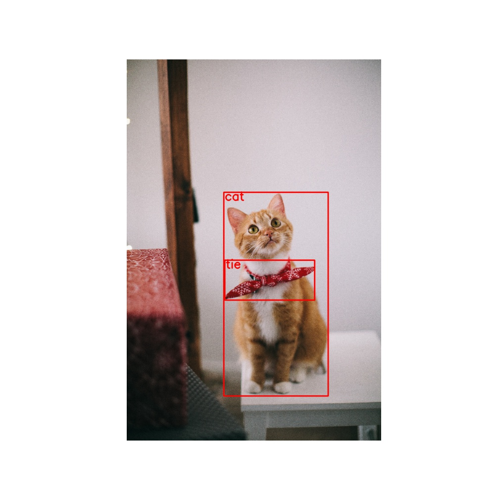
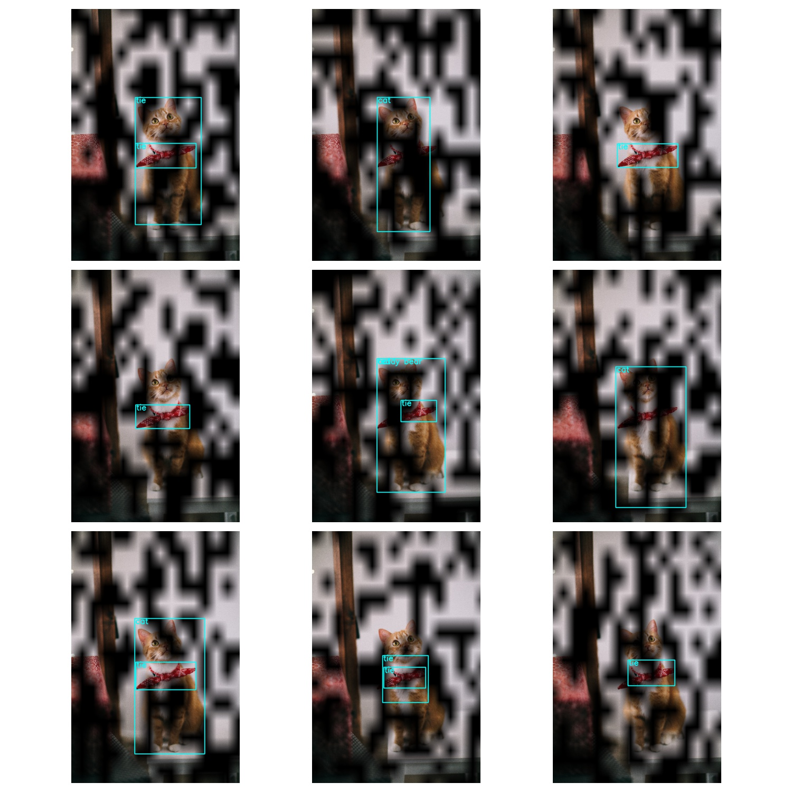
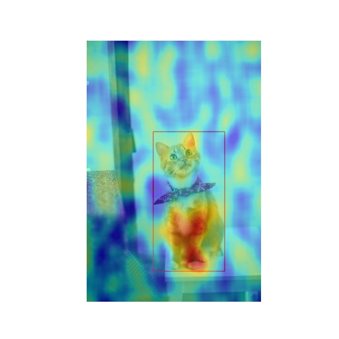
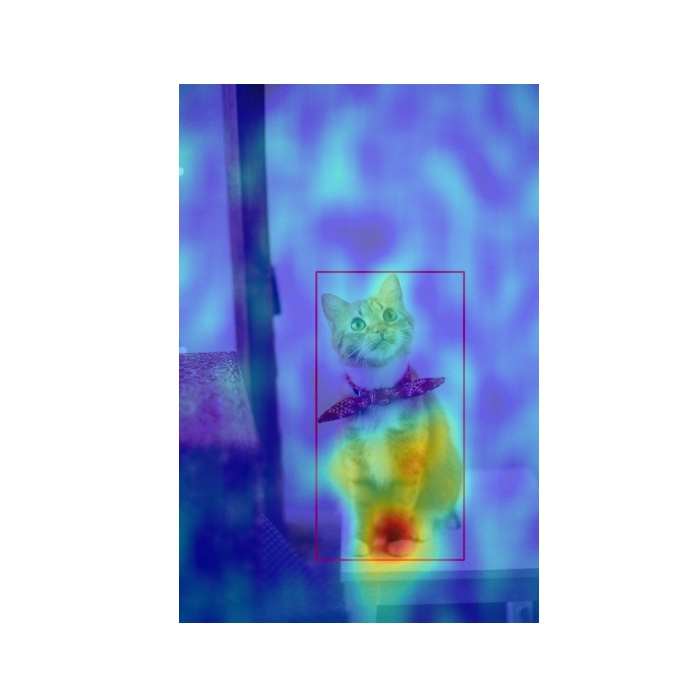
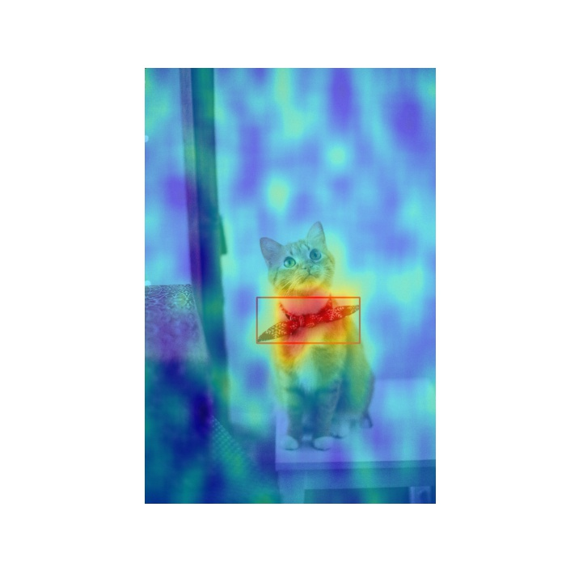

This repository is a third party implementation of the [D-RISE](https://arxiv.org/abs/2006.03204) paper.

## Usage

- The codes use [ScaledYOLOv4](https://github.com/yhsmiley/ScaledYOLOv4/tree/yolov4-large-dev) as the object detector. Follow the instructions in the repo to install (or uncomment in the Dockerfile), or use your own detector.

1. Generate outputs from object detector and sample masks with `generate_samples.py`
2. Run `drise_image.py` to generate D-RISE results for an image and given target detection (from output of generate_samples.py, or any arbitrary target (e.g. missed ground truths))

Play around with the grid size and probability for mask generation, and number of masks to get a good visualization!

Note:
- To use jupyter notebook inside docker, run `jupyter notebook --ip=0.0.0.0 --allow-root`

## Examples

Original detections and sample masks  
 

cat, 1000 masks, grid size (16, 16), probability 0.5  

cat, 5000 masks, grid size (16, 16), probability 0.5  

tie, 1000 masks, grid size (16, 16), probability 0.3  

## References

- Petsiuk, Vitali, Rajiv Jain, Varun Manjunatha, Vlad I. Morariu, Ashutosh Mehra, Vicente Ordonez, and Kate Saenko. "Black-box Explanation of Object Detectors via Saliency Maps." Proc. of the IEEE Conference on Computer Vision and Pattern Recognition (CVPR), 2021. [arXiv:2006.03204](https://arxiv.org/abs/2006.03204), [Project Page](https://cs-people.bu.edu/vpetsiuk/drise/)
- https://github.com/hysts/pytorch_D-RISE
